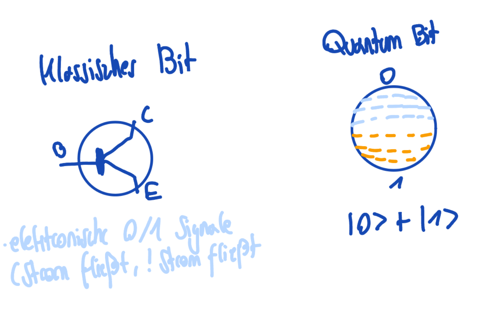

## Einführung in das QuantumComputing (QC) - Notizen
### Einstiegszitat
> "Wir sind ungefähr da, wo klassicsche Computer in den 1950ern waren, die Theorie existiert, die Hardware steckt noch in den Kinderschuhen. Das volle Potential (z.B. Short Algorithmus zu knacken von Verschlüsselungen) braucht millionen-fehlerkorrigierten Qubits" ­~ Claude 
- Differenzierung der bekannten Begriffe: Quantenphysik ist die Oberkategorie und schließt Quantenmechanik/-computing mit ein. Wobei die Quantenmechanik die mathematische Grundlage ist. Sie beweist und beschreibt wie Materie auf atomarer Ebene funktioniert und gibt uns mithilfe der komplexen Zahlen jede Begründung die für die Anwendung des Quantencomputings verwendet wird. Das Quantencomputing ist dabei die reine-/Ingenieurswissenschaft, welche Quantenmechanik Phänomene (Superposition, Inferenz etc.) Rechengrundlage verwendet. Die größte Überlappung mit meinem Interessensgebiet + Forschungs Relevantheit liegt im `Quantum Chaos`. Es beschreibt das Verhalten von klassischen Pendant chaotisch ist. 
### Quantenbits
- rekursive Operatoren wie Fibonacci oder Fakultät sind mathematische Konzepte, bei welchen unseren heutigen Computer an ihre Grenzen stoßen &rarr; exponentielles Wachstum
- Würde man bspw. ein ganz einfaches Problem wie die Sitzpositionsmöglichkeiten von 30 Gästen nehmen, so hat man eine hohe/exponentiell wachsende Kombinationsmöglichkeit, um ein Entscheidungskonzept (Dijkstra etc., kürzeste Wege) anzuwenden. 
> Das Qubit hat vor der Messung keinen Zustand, der für uns auswertbar ist. Die Messung bringt das Qubit zum kollabieren in einem der beiden Zustände ($1/2$)
- Ein Quantencomputer ist nicht per se schneller als ein herkömmlicher Computer, er löst algorihtmitische Probleme (durch die gegebene Linearität auch nicht alle) einfach mit weniger Operationen &rarr; solving `PDE's`, Encrypting und das Verhindern von Decrypting & Optimierung von Systemen (Entscheidungsmodelle / Energy Minimuzation, Decoded Quantum Inferferometry)
- Quantencomputing ersetzt nicht einfach tradionelle Computer, sondern sollte (auch aus Kostengründen) aktuell nur für algorithmische und numerische komplexe Thematiken und Forschungsgebiete verwendet werden
- die (ino) beste Beschreibung für den Stand zwischen $0/1$ (`Superposition`) ist das Beispiel mit einer Kaffeebestellung. Wenn du dir unsicher bist was du bestellen möchtest und zwischen zwei (oder mehr aber bleiben wir mal bei zwei) Optionen stehst, bist du in einer Art `Superposition`. Es wäre so, als würdest du eine Münze werfen und in der Luft nicht klar ist, welchen Zustand die Münze gerade hat

- Der obere Vergleich fasst noch keine mathematische Begründung zusammen, daher: 
$$
\|\psi\rangle = \alpha\|0\rangle + \beta\|1\rangle
$$
- $\alpha$ und $\beta$ sind Aplituden und somit komplexe Zahlen (hier die Wurzel aus der Annahme, wenn sich der Zustand eines Systems ändert) die beschreiben, wie stark die Basiszustände ($0/1$) für $\psi$ am Ende enthält das Quadrat von $\alpha$ und $\beta$. Komplexe Zahlen besitzen eine Phase auf der komplexen Ebene, welche zur Interferenz führt (das Überlappen der Wellen zweier komplexen Zahlen und komplexer Ebene). Auf dem Konzept der `Interferenz` basiert die hohe Rechenleistung eines Quantencomputers
- Elektronen Spins und Phototen zeigen das Konzept eines `Superpositionszustandens`, es gibt zwei Standard Zustände (Up/Down || Vertikal/-Horizontale Polarisierung). Dabei ist der "dritte Zustand" genau das physische Konzept: Elektronen Spins enthalten erst bei der Messung einen festen Wert (Wellen Überlappung) und diagonale Polarisierung von Phototen
$$
\|\psi\rangle = \alpha\|\uparrow + \beta\|\downarrow\rangle 
$$
- diese physischen Mechanismen sind *KEINE* Analogien. QC verwendet supraleitende Schaltkreise, in welchen exakt das beschriebene Verfahren verwendet wird. Die Photonen sind photonikbasiert QC's reale polarisierte Lichtteilen 

*Workflow:* wir encoden binary input data in den Quantenalgorithmus, auf welchem Quantum Operationen erfolgen. Am Ende transformieren wir die erhalten Qubits, um sie wieder in normale Bits zu übersetzen (cf. "Quantum Circuit Model"). Zusammengefasst: Input - Bits, Quantum Operationen . Qubits, Output - Bits
### Mathematische Grundlage
- Vektor Operationen sollte klar sein, wird hier übersprungen
- $\Re$ und $\Im$: Bei einer komplexen Zahl $z = a + bi$ ist $\Re(z) = a$ der *Realanteil* (messbare Amplitude, Wahrscheinlichkeit) und $\Im(z) = b$ der *Imaginäranteil* (Phase, steuert Interferenz). Im QC gilt: $\|a\|^2 = \Re(a)^2 + \Im(a)^2$ gibt die Messwahrscheinlichkeit, während das Verhältnis von $\Re/\Im$ die Phase bestimmt, die konstruktive oder destruktive Interferenz erzeugt
#### Komplexe Zahlen
- sind imaginäre Zahlen, welche als reale Zahlen geschrieben werden und mit der imaginären Einheit `i` multipliert 
- $i^2 = -1$ dient als Ausgangslage, da dieser Zustand mit reelen Zahlen nicht erreichbar ist
- Komplexe Zahlen beeinhalten somit eine reele Zahl und eine imaginäre Komponenente §z = a + bi§
- $\theta$ ist der `phase angle` $\angle$ und beschreibt den Winkel eines Vectors  

- wir haben somit zwei unterschiedliche Arten einer komplexen Zahl in einem 2-Dimensionalen Koordinatensystem dazustellen: 
$z = a + bi = re^{i\theta}$ &rarr; wichtig ist hier zu sagen, dass $a$, $b$ und $re$ und $\theta$ nicht äquivalent sind
#### Eulers Form 
- um die Verbindung von den beiden Formaten dazustellen, brauchen wir die eulische Formel:
$$
e^{i\theta} = cos(\theta) + i \cdot sin(\theta)
$$
&rarr; mit der magnitude $r$ multiplizieren
$$
re^{i\theta} = r(cos(\theta) + i \cdot sin(\theta) = rcos(\theta) + ri\cdot sin(\theta))
$$
&rarr; hier ist $rcos(\theta)$ die "reele Komponente" und $ri\cdot sin(\theta$ die "imaginäre 
#### Absolute Values einer komplexen Zahl 
- Distanz von dem Ursprungspunkt, einfach den Betrag der Polar Form nehmen:
$$
z = re^{i\theta} = \|z\| = r
$$
- um einen Vektor zu transposen, wird folgende Notation verwendet:
- "Transpose a vector and conjugate each of its elements"
- "the conjugate transpose of a vector `a` will be denoted as $a^\dag$
$$
a^\dag = (a^\ast)^T = (a^T)^\ast
a = \begin{bmatrix}2i \cr 13 \cr 6 - i\end{bmatrix} \rarr a^\dag = \begin{bmatrix} -2i & 13 & 6 + i\end{bmatrix}
$$
#### Conjugate Transpose ($\dag$, "Dagger")
- zwei Operationen in einem: Transponieren (Spaltenvektor &rarr; Zeilenvektor) + Konjugieren (jedes $i$ wird zu $-i$)
- Notation: $a^\dag = (a^*)^T = (a^T)^*$ (&rarr; die Reihenfolge in welcher wir Transponieren $A^T$ ist egal für das konjugierte transponieren)
$$
A = \begin{bmatrix} a & b \cr c & d\end{bmatrix} \rarr A^T = \begin{bmatrix} a & c \cr b & d\end{bmatrix} \rarr A^\dag = \begin{bmatrix} a^* & b^* \cr b^* & d^*\end{bmatrix}
$$
- im QC: $\|\psi\rangle$ (Ket) ist der Spaltenvektor, $\langle\psi\| = \|\psi\rangle^\dag$ (Bra) ist der Zellenvektor &rarr; `Bra-Ket-Notation`
- Wahrscheinlichkeit: $\langle\psi\|\psi\rangle = \|\alpha\|^2 + \|\beta\|^2 = 1$
- Quantengatter $U$ müssen $U^\dag U = I$ erfüllen (unitär) &rarr; sichert die Nomierung des Zustandes
#### Hermitische Matrix 
- eine Matrix hermitisch wenn $ H = H^\dag$ (gleich ihrem eigener Conjugate Transpose) ist
- hermitische Matrizen haben immer reele Eigentwerte &rarr; Messergebnisse im QC sind immer reele Zahlen, daher müssen sie Observablen hermitisch sein
#### Computational Basis State
$$
\|0\rangle = \begin{bmatrix} 1 \cr 1 \end{bmatrix} 
$$
$$
\|1\rangle = \begin{bmatrix} 0 \cr 1 \end{bmatrix}
$$ 
- Wenn wir die Wahrscheinlichkeit $\psi$, ob wir 1 oder 0 bekommen, können wir anhand des 2 Dimensionalen Vektors sehen, wie hoch die Wahrscheinlichkeit hierfür ist 
- $\langle \psi \|$ ist die konjugierte-transporter Vektor von $\|\psi \rangle = \begin{bmatrix} \alpha \cr \beta \end{bmatrix} \rarr \langle\psi\| = \|\psi\rangle^\dag = \begin{bmatrix} \alpha^* & \beta^* \end{bmatrix}$ 

- Die **globale Phase** ist einfach eine mathematische Darstellung  die wir brauchen, um Quatum States dazustellen. Wir können diese nicht beobachten (&rarr; in einer Sphäre darstellen), wodurch wir diese einfach ignorieren. Sie existiert einfach und wird nicht weiter bearneitet/verwendet
- Die **relative Phase* beeinflusst die Herleitung und die gezeigte Darstellung der Sphäre im Notebook, somit ghee ich nicht weiter drauf ein. Die **relative Phase** ist die Differenz von zwei Phasenvektor unserer zwei Amplituden
- Wir Formen die klassische Schreibweise $\|\psi \rangle = \alpha\|0\rangle + \beta\|1\rangle$ in die polare Form ($re^{i\theta}$) &rarr; ich überspringe hier einmal die Umformung (ist eigentlich nur ne klassische $* -(e{i\theta}$) Umformung) 
$$
\|\psi\rangle = r_\alpha\|0\rangle + r_\beta^{i\Phi}1\rangle 
$$
> Hintergrund: $\Phi$ ist einfach eine Zusammenfassung von $\theta_\beta - \theta_\alpha = \Phi$, somit ist die Differenz $\Delta$ und ist hier die **relative Phase!**
- Wir haben somit 3 reale (reele & imaginär) Variablen, welche wir sehr gut im 3 dimensionalen Raum darstellen könenn 
#### Multiple Qubits
- the first position by the first bit is on the right $\|01\rangle$, in this case the `1`. The basis state are:
$$
\|00\rangle = \begin{bmatrix} 1 \cr 0 \cr 0 \cr 0\end{bmatrix}
$$
$$
\|01\rangle = \begin{bmatrix} 0 \cr 1 \cr 0 \cr 0\end{bmatrix}
$$
$$
\|10\rangle = \begin{bmatrix} 0 \cr 0 \cr 1 \cr 0\end{bmatrix}
$$
$$
\|11\rangle = \begin{bmatrix} 0 \cr 0 \cr 0 \cr 1\end{bmatrix}
$$
#### Applied multiple qubits - Superposition of two qubits
$$
\|\psi\rangle = a\|00\rangle + b\|01\rangle + c\|10\rangle + d\|11\rangle = \begin{bmatrix} a\cr b \cr c \cr d\end{bmatrix}
$$
- A uniform superposition is a superposition, where all outcomes have the exact same output chance
- ein bytes kann $2^8$ states besitzen (size of `int`, 256 mögliche Kombinationen) beschreiben, wodurch wir nur einen `int` brauchen. Durch die Superposition erhalten wir neben den "normalen" bit Kombinationen 256 komplexe Zahlen (a,b,c..)
$$
c\|00000000\rangle + b\|00000001\rangle + c\|00000010\rangle..
$$
- durch das hinzufügen der komplexen Zahlen müssen wir zusätzliche Informationen abdecken, die ein einzelner `int` nicht abdecken kann. Für ein byte bräuchte man 512 `floats`. Das Problem ist aber, dass es ein exponentienelles Wachstum gibt, wodurch man bei 32 bits (4 bytes) man knapp 8.6 Millionen floats braucht (~34gb)
#### Quanten Algorithmus
- um die unterschiedlichen Prozesse zu visualisieren, wird ein `Quantum Circuit Model` verwendet

- in dem Fall die 3 klassischen Bits (`meas`) werden nur dafür genutzt, die Ergebnisse zu speichern. Daher ist diese als Measuring Line dargestellt. Die Zeit vergeht von links nach rechts und am Ende werden die Measurement Elemente (die "Tach" Symbole) verwendet, um die Values aus den Qubits auszuwerten
- eine unitäre Matrix, wenn wir diese mit ihrem Conjugate Transpose multiplizieren wollen ($U^\dag * U$) erhalten wir die Identitätsmatrix ($\begin{bmatrix} 
1 & 0 & 0 & 0 \cr
0 & 1 & 0 & 0 \cr
0 & 0 & 1 & 0 \cr 
0 & 0 & 0 & 1
\end{bmatrix}$), wodurch wir $U^\dag U = UU^\dag$ erhalten. Das bedeutet, dass wenn wir eine unitäre Matrx $U$ mit $\psi$ multiplizieren, ist die Magnitude aus der Multiplitkaion äquivalent zu der Magnitude von $\psi$:
$$
\|U|\psi\rangle\| = \||\psi\rangle\|
$$
### Gate logic differences
- Quantum logic gates sind `reversable`, bedeutet man kann eine inverse Operation auf das Qubit durchführen und erhält den ursprünglichen Zustand, bevor das Qubit durch das Gate ging 
####  Pauli Gates 
- alle drei Pauli Gates operieren auf einem einzelnen Qubit und rotieren auf $\pi$ um die major Achsen auf der Bloch Sphäre der drei Achsen X, Y, Z und werden als $\sigma$ beschrieben
$$
X = \sigma_x = \begin{bmatrix} 0 & 1 \cr 1 & 0 \end{bmatrix} \qquad
Y = \sigma_y = \begin{bmatrix} 0 & -i \cr i & 0 \end{bmatrix} \qquad
Z = \sigma_z \begin{bmatrix} 1 & 0 \cr 0 & -1 \end{bmatrix} \qquad
$$
#### Pauli X Gate (NOT)
- Single Qubit Gate welches $\|0\rangle$ und $\|1\rangle$, somit ist es einfach `NOT` &rarr; wird als Crosshair dargestellt 
- als Hilfestellung kann man sich vorstellen, dass die Bloch Sphäre um 180° gedreht wird (bzw. der Punkt der auf der Sphäre liegt). Dadurch dass es immer 180° sind, springen wir immer von 0 auf 1 und andersherum. Beispiel:
$$
\|\psi\rangle = a\|0\rangle + \beta\|1\rangle 
$$
$\qquad \qquad \qquad \qquad \qquad \qquad$ &darr; 
$$
X \|\psi\rangle = a\|1\rangle + \beta \|0\rangle
$$
- da wir nicht immer einen festen Winkel von $\theta = \pi$ haben, verwenden wir neben dem Pauli Gates auch `Rotation Gates`. Diese verwenden einen beliebigen Winkel und können kontinuierlich rotiert werden (keine Flip Operationen wie bei Pauli)
$$
\begin{bmatrix} cos(\frac{\theta}{2}) & - \iota sin(\frac{\theta}{2}) \cr
                -\iota sin(\frac{\theta}{2} & cos(\frac{\theta}{2})
\end{bmatrix}
$$
#### Pauli Y Gate
- Rotiert auf $\pi$ um die Y-Achse auf der Bloch Sphäre, es wird im Vergleich zum X Gate, werden zum einen die Qubits geflipped, zum Anderen wird der 'face'-Faktor auf `i` hinzugefügt 
$$
Y\|\psi\rangle = \begin{bmatrix} 0 & -i \cr i & 0\end{bmatrix} * 
\begin{bmatrix} \alpha \cr \beta\end{bmatrix} = 
\begin{bmatrix} -i \beta \cr ia\end{bmatrix} = 
 i * \begin{bmatrix} - \beta \cr \alpha \end{bmatrix} = 
 i(\alpha\|1\rangle - \beta\|0\rangle)
$$ 
- Für Pauli Y entspricht das `Rotations Gate`:
$$
\begin{bmatrix} cos(\frac{\theta}{2}) & -sin(\frac{\theta}{2}) \cr
                sin(\frac{\theta}{2} & cos(\frac{\theta}{2})
\end{bmatrix}
$$

#### Pauli Z Gate
- Rotiert auf $\pi$ um die Z-Achse auf der Bloch Sphäre, es wird im Vergleich zu X Gate, werden zum einen die Qubits geflipped, des Weiteren wird der 'face'-Faktor auf `i` hinzugefügt 
$$
Y\|\psi\rangle = \begin{bmatrix} 1 & 0 \cr 0 & -1 \end{bmatrix} * 
\begin{bmatrix} \alpha \cr \beta\end{bmatrix} = 
\begin{bmatrix} \alpha \cr -\beta\end{bmatrix} = 
 \alpha\|0\rangle - \beta\|1\rangle
$$ 
- Für Pauli Y entspricht das `Rotations Gate`:
$$
\begin{bmatrix} cos({e^{-\iota \frac{\theta}{2}}}) & 0 \cr
                0 & e^{\iota \frac{\theta}{2}}
\end{bmatrix}
$$
#### Hadamard Gate 
rotiert um die Bloch Sphäre mit dem Vektor $$